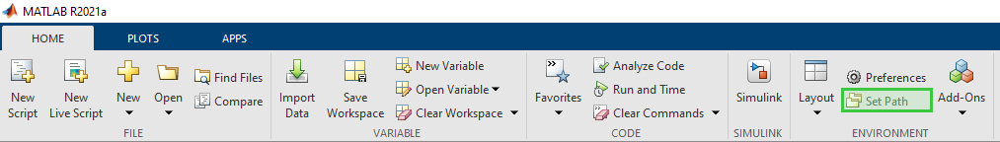

# C2XLib

C2XLib is a C++ implementation for ETSI standardized communication protocols Co-operative Awareness Messages (CAM) and Decentralized Environmental Notification basic service Messages (DENM) for Windows and Linux with an Embedded Coder compatible Simulink API. These protocols are used for car to car (C2C) and car to infrastructure (C2X) communication. This implementation uses UDP as the transport layer and supports multiple encoding rules.

## Installation
This repository includes precompiled and ready to use packages for Windows and armv7 architecture.

### Armv7
Extract the files from the [library packet](c2xlib-armv7.tar.gz):
```
tar -xf c2xlib-armv7.tar.gz
```

And run the setup script from the extracted directory:
```
cd c2xlib-armv7/
./setup.sh
```

### Windows 
For setup on Windows and usage in Simulink, you can run the precompile and ready-to-use Windows installer or compile the library by yourself.

The easiest and fastest way is to use the installer:
1. Download and run the [Windows installer](C2XLib-0.1.0-win64.msi). The installer does not really install something, it is just a convenient way of copying the files to the correct directory.
2. Add the following path to the compiled library to your environment variables. Simulink must find the library files. Otherwise, it will not run simulations when it can not find the execution engine.
```
C:\Program Files\c2xlib\lib
```
3. Open (or restart) Matlab and add the installation path to your Matlab paths.
```
C:\Program Files\c2xlib\matlab\c2xlib
```


After successful installation, you find the C2XLib in your Simulink Library Browser, and you can add the API blocks to your model. Look into the matlab/examples directory for some examples, which you can also find under the following path.
```
C:\Program Files\c2xlib\matlab\examples
```

<!--## Matlab/Simulink Codegeneration-->

## Build

### Dependencies
This project is built with CMake and has multiple targets. By default only the library is built to have minimal dependencies. The following table lists and describes the possible targets and their additional dependencies upon libraries or programms.

#### Minimal requirements:
* CMake (at least version 3.6.0)
* C/C++ Compiler 
    * For Linux: gcc and make
    * For Windows: MSVC

The following variables are turned off by default. To enable them add `-D<variable name>=ON` cmake command.
| CMake Variables | Description                                                                                           | Additional Requirements                                     |
|-----------------|-------------------------------------------------------------------------------------------------------|-------------------------------------------------------------|
| BUILD_TESTS     | Enables and builds the test project.                                                                  | GoogleTest (update git submodules)                          |
| INSTALL_MATLAB  | Includes the Matlab/Simulink library for installation.                                                | Matlab R2016b or higher (only needed for execution)                          |
| BUILD_CLI       | Build the c2xcli tool. Used to log, construct, send or transmit CAM and DENM packages from terminal.  | Boost Library <ul> <li>Program Options (version 1.62 or above)<li>Filesystem (version 1.62 or above)</ul> |